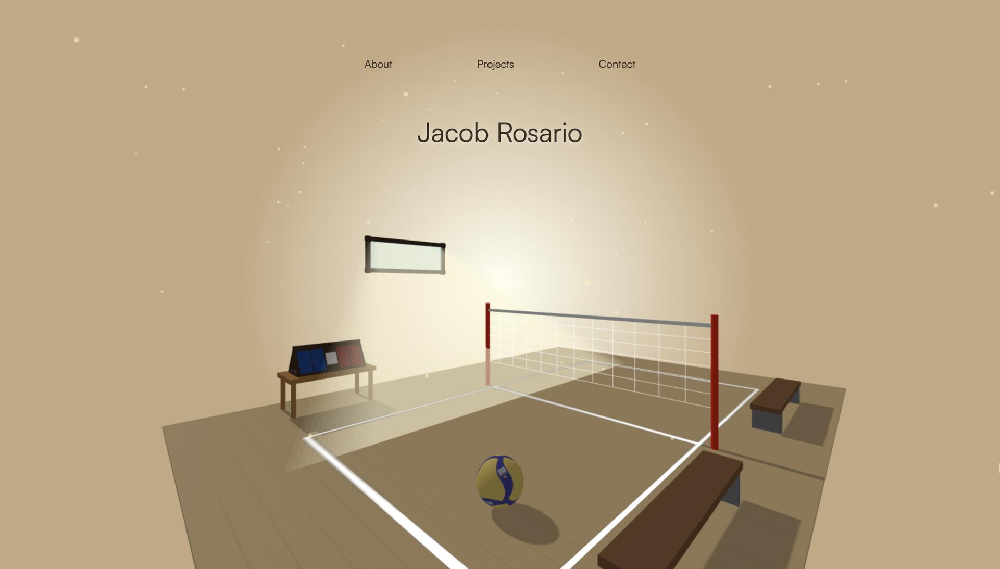

# Personal Website

An interactive portfolio built around a 3D volleyball court. The whole page is a live Three.js scene — you can orbit the camera, and the ball on the floor is hittable: run your cursor into it and it pops up with spin and bounces until it settles.

**Live app:** jacobrosario.com



---

## Why I built it

Most portfolio sites are a list of links, and mine would have been too. But everything else I've built is volleyball — a stat tracker, a spike timer — and a static page felt like a strange front door for that.

So the site became the thing it's introducing:

1. **Make the page a place, not a document** — a court rendered in 3D instead of a hero image of one.
2. A scene you can only look at gets old fast → add **orbit controls** so the camera is yours.
3. A ball sitting still on a court is a screenshot → give it **gravity and a hit response**, so the first thing anyone does is knock it around.
4. Three.js scenes turn into one thousand-line file quickly → split every object into its **own builder**, so adding a scoreboard doesn't mean touching the net.
5. The content still has to be readable → layer a **modal dashboard** over the scene rather than navigating away from it.

---

## Features

### The court

A full scene assembled from scratch: floor with painted lines, net, benches, a scoreboard, a window casting light across the boards, and drifting dust motes. The ball is a real Mikasa V200W model loaded from FBX with its base-color texture. Camera movement is orbit-controlled, so you can look around the court from anywhere.

### Hitting the ball

Move your cursor into the ball and it launches away from the point of contact, always with a guaranteed upward pop so it never gets nudged flat into the floor. Spin is derived from the direction it was hit, so it visibly rotates the way it was struck, then loses angular velocity on each bounce.

### The dashboard

**About**, **Projects**, and **Contact** open as modals over the scene — the court keeps rendering behind a blurred backdrop instead of unloading. On desktop, arrows either side move between them; on mobile, the same navigation is a horizontal swipe with a hint bar showing which section is next. Projects carries screenshots, tags, live links, and completion dates for each build.

### Mobile

A `useIsMobile` hook drives a real layout switch at 768px rather than CSS breakpoints alone — font sizes, menu spacing, arrow-vs-swipe navigation, and the dual-image project layout all change behavior, not just size.

---

## Tech stack

| | |
| --- | --- |
| Framework | React 19 |
| Build tool | Vite 8 |
| 3D | Three.js |
| Model loading | FBXLoader |
| Physics | Hand-rolled — no engine |
| Typography | Satoshi via Fontshare |
| Hosting | Vercel |

---

## How it works

**One builder per object.** Every element in the scene is its own factory — `createNet(scene)`, `createFloor(scene)`, `createBenches(scene)` — that builds its meshes, adds them to the scene, and returns a handle. `Scene.jsx` is just the assembly order. Adding the scoreboard was a new file and one line, with nothing else touched.

**One loop drives everything.** A single `requestAnimationFrame` loop advances the controls, the physics step, the dust drift, and the hit check, then renders. There's no per-object update scattered across components, and the whole thing tears down in one cleanup function.

**Physics is about forty lines, not a library.** Gravity is a constant added to velocity each frame; the floor collision inverts and damps it to 0.8, friction scales horizontal velocity by 0.97, and both cut out entirely below a threshold so the ball actually comes to rest instead of jittering forever. Invisible walls derived from the floor's own width keep it on the court:

```js
const wallXMin = floorCenterX - floorWidth / 2 + ballRadius
const wallXMax = floorCenterX + floorWidth / 2 + ballRadius
```

**Hit detection without a raycaster.** Rather than casting a ray into the scene, the ball's 3D position is projected into normalized screen space and compared against the cursor as a flat 2D distance:

```js
const ballPos = ball.position.clone()
ballPos.project(camera)
const distance = Math.sqrt(dx * dx + dy * dy)
if (distance < hitRadius) { /* apply impulse */ }
```

Cheaper than a raycast and it runs every frame without noticeable cost. The impulse points away from the cursor, gets clamped upward, and sets angular velocity proportional to the hit — so direction, height, and spin all fall out of the same two numbers.

**Modal state is one index.** `useModalState` holds the active section name and its position in `["About", "Projects", "Contact"]`. Next and previous are index arithmetic, clicking an open section toggles it shut, and the modal itself stays presentational.

### Project structure

```
src/
├── App.jsx                          # scene + dashboard, with a load fade
├── components/
│   ├── Scene/
│   │   ├── Scene.jsx                # camera, renderer, animation loop
│   │   ├── createVolleyball.js      # Mikasa FBX + texture
│   │   ├── createFloor.js           # court and painted lines
│   │   ├── createNet.js
│   │   ├── createBenches.js
│   │   ├── createScoreboard.js
│   │   ├── createWindow.js
│   │   ├── createLighting.js
│   │   ├── createDust.js
│   │   └── createOrbitControls.js
│   ├── createPhysics.js             # gravity, bounce, friction, walls
│   ├── createHitDetection.js        # screen-space cursor collision
│   ├── createMouseTracking.js       # pixels → normalized coords
│   └── Dashboard/
│       ├── Dashboard.jsx            # name, menu, modal mount
│       ├── Modal.jsx                # arrows, swipe, slide animation
│       ├── useModalState.js         # which section is open
│       └── Content/
│           ├── AboutContent.jsx
│           ├── ProjectsContent.jsx
│           ├── ContactContent.jsx
│           └── useIsMobile.js       # 768px layout switch
└── index.css
```

---

## Running locally

Requires Node.js 20+.

```bash
git clone https://github.com/jrosario0225/personal-website.git
cd personal-website
npm install
npm run dev
```

Then open the URL Vite prints (usually `http://localhost:5173`).

### Scripts

| Command | What it does |
| --- | --- |
| `npm run dev` | Start the Vite dev server with hot reload |
| `npm run build` | Production build into `dist/` |
| `npm run preview` | Serve the production build locally |
| `npm run lint` | Run ESLint over the project |

---

## Known limitations / next up

- **The ball can't be hit on mobile** — hit detection listens for `mousemove` only, so on touch devices the ball drops, settles, and stays there. A `touchmove` handler feeding the same coordinates would fix it.
- **Physics is frame-rate dependent** — velocity is advanced by a fixed amount per frame with no delta time, so the ball falls noticeably faster on a 120Hz display than a 60Hz one. Scaling each step by elapsed time is the fix.
- **Hit detection ignores depth** — because the check is screen-space distance, the cursor connects with the ball whenever it passes over it visually, regardless of how far away it is in the scene.
- **Asset sizes** — `logo.png` is 1.3 MB for a favicon and `contactGif.gif` is 1.9 MB, which is most of the initial download on a slow connection.
